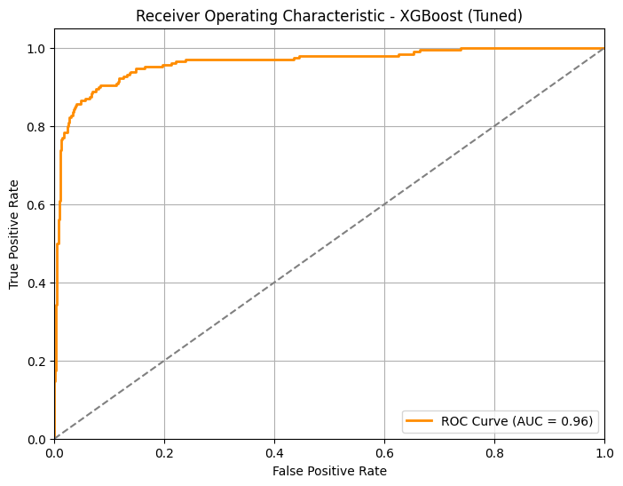
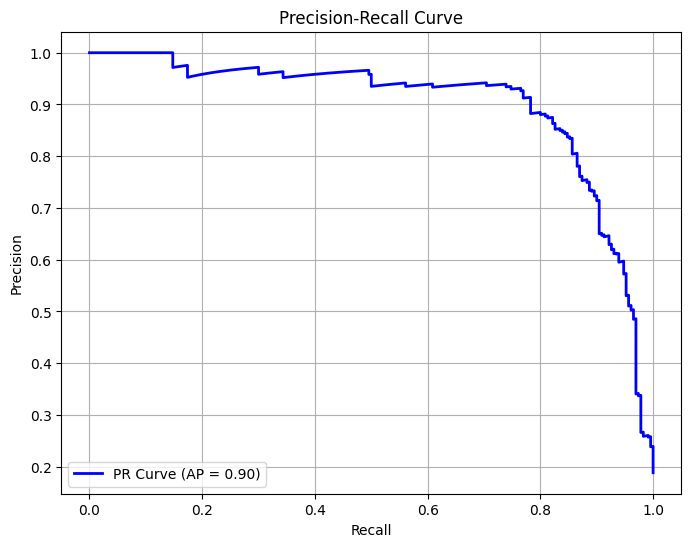

# 📊 WanderWell Retreats – Smart Expansion Through Data-Driven Marketing

## 🧩 Problem Statement

WanderWell Retreats, a modern travel startup known for curated and personalized travel experiences, is facing low conversion rates (~12%) on its premium travel packages due to non-targeted marketing strategies. Rising customer acquisition costs and minimal returns have made it crucial to improve outreach strategies by understanding customer preferences and predicting purchase behavior, especially with the upcoming launch of its Serenity Escape wellness package.

## 🎯 Project Objective

The objective of this project is to leverage customer data to build a predictive and analytical framework that will enable WanderWell Retreats to strategically launch the Serenity Escape wellness travel package. 

## 📂 Dataset Overview

* The dataset used in this project is sourced from Kaggle and consists of 4,888 customer records with a mix of demographic, behavioral, and transactional features relevant to travel package purchase behavior.

- Key characteristics:

* Includes categorical, numerical, and binary features.

* Features: Demographic, behavioral, and transaction-related columns

* Target: ProdTaken (1 = purchased, 0 = not purchased)

* Imbalanced: Only ~18% positive class

## ⚙️ Approach

* Performed EDA to identify KPI's and high conversion segments

* Preprocessed the data (OHE for categorical Features , Scaling for numerical Features using Column Transformer for efficient preprocessing). Handles missing data using mode and median. 

- Used XGBoost, Random Forest, and Gradient Boosting with:

* Imbalanced data handling (scale_pos_weight, class_weight).

* Model evaluation with Accuracy, F1, ROC-AUC.

* Hyperparamter Tuned the XGBoost model using roc_auc score as scoring metric

## 🪄 Results

- After model tuning, the final XGBoost model achieved:

* ✅ Accuracy: 94.27%
* ✅ F1 Score: 0.84
* ✅ Precision: 0.87
* ✅ Recall: 0.81

* *Precision = 0.87 → When the model predicts a customer will purchase, it is correct 87% of the time, indicating low false positives.

* *Recall = 0.81 → The model successfully identifies 81% of all actual purchasers, indicating low false negatives.

* *An F1-Score of 0.84 shows that the model is both precise in its positive predictions and capable of capturing most potential buyers, which is crucial for efficient, targeted marketing on imbalanced data.

- Plotted the ROC-AUC Curve and 

* ✅ ROC-AUC Score: 0.96 Precision-Recall Curve
* ✅ Average Precision (PR AUC): 0.90

* A high ROC-AUC indicates the model can effectively discriminate between customers who will purchase and those who will not across various thresholds. This allows flexibility to adjust the decision threshold according to business needs (e.g., prioritizing recall to capture more potential buyers, or precision to reduce marketing costs).

* By plotting the Precision-Recall Curve, it got confirmed that the model maintains high precision while achieving high recall, even on imbalanced data. The high average precision score shows robust model performance for identifying likely buyers, supporting cost-effective, targeted campaigns.

## 📈 Model Performance Visualizations

### ROC Curve

### Precision-Recall Curve

## 📊 KPI's

* ✅ Target Age Group: Customers aged 18-25 show the highest conversion rates among all age segments.

* ✅ Occupation Impact:

Freelancers show high conversion rates but represent a small base.

Large Business Owners demonstrate highest conversion rates among significant segments.

* ✅ Follow-Up Strategy:

Conversion rates increase with the number of follow-ups.

6 follow-ups identified as the optimal point for maximizing conversions.

* ✅ Marital Status:

While the customer base is mostly married, unmarried customers have higher conversion rates.

* ✅ Group Size Preference:

Group travelers (2-7) show consistent purchase rates.

Solo travelers rarely purchase; couples and small groups should be marketing focus.

* ✅ Pitch Satisfaction:

High conversion rates among customers rating pitch satisfaction between 3-5.

* ✅ Passport Ownership:

Customers with a passport have higher conversion rates.

Customers with both a car and a passport have the highest purchase rates.

* ✅ Property Preference:

Higher preferred property star ratings correlate with higher purchase rates.

Indicates targeting luxury-inclined customers increases conversions.

* ✅ Income Bracket Efficiency:

Customers earning between 10K-30K show the highest purchase rates.

* ✅ Feature Correlation:

Strong positive correlation found between Passport ownership and Purchase (ProdTaken), confirming its predictive value.

## 💡 How these KPIs help WanderWell

- These KPIs help prioritize marketing strategies, such as:

* Targeting young (18-25), unmarried customers in 2-7 member groups.

* Focusing marketing on customers with passports, luxury property preferences, and in the 10K-30K income bracket.

* Ensuring sales teams aim for 6 follow-ups and high pitch satisfaction.

* By aligning marketing and sales strategies with these KPIs, WanderWell can improve conversion rates while reducing customer acquisition costs effectively.

## 📈 Key Takeaways

* ✅ XGBoost performed well on the imbalanced dataset

* ✅ ROC-AUC and Precision-Recall curves provided clear insights for threshold tuning.

* ✅ The model can now be used for targeted outreach to high-likelihood customers, reducing marketing costs while improving conversions.

